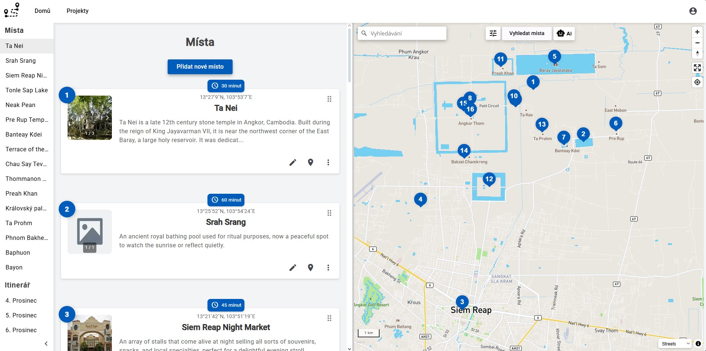
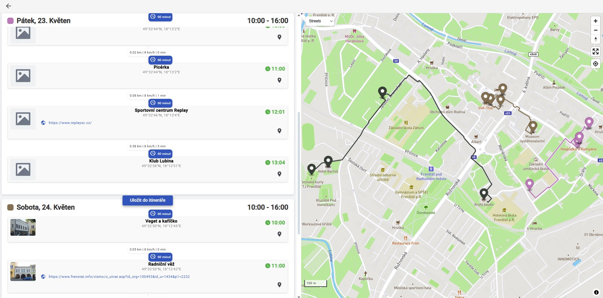

# Itinerary Management Application

[](https://github.com/Jyrycek/Itinerary-Management/actions/workflows/ci.yml)
[](LICENSE)
[](https://angular.io/)
[](https://dotnet.microsoft.com/)

---

## Project Overview

Itinerary Management is a web application designed to simplify travel planning.  
It allows users to create trips, manage unvisited locations, and optimize itineraries efficiently using **modern technologies** and **optimization algorithms**.

The app is built with **Angular 20** for the frontend and **ASP.NET Core 9** for the backend.  
It integrates with **Azure services** (SQL Database, Blob Storage, Key Vault) for secure storage and seamless deployment.

## Screenshots

### Project Page
  
*Interface for managing trips and locations, with days and map visualization.*

### Optimized Routes
  
*Example of route optimization using the Ant Colony Optimization algorithm.*

---

## Features

- Create, manage, and plan personalized travel itineraries  
- Automatically optimize routes and daily schedules using advanced algorithms  
- Manage places, tags, and trip details with full CRUD functionality  
- View interactive maps and calculated optimal routes  
- Fetch location details from external APIs  
- Secure user authentication and password reset functionality  
- Error tracking and performance monitoring  
- Responsive design optimized for desktop and mobile use

---

## Tech Stack & Key Components

### Frontend (Angular)
- **Angular 20** – main framework for UI and client logic.
- **Angular Material** – responsive components and theming.
- **ngx-toastr** – toast notifications for user feedback.
- **Lightbox** – image preview and gallery functionality.

### Backend (.NET Core)
- **ASP.NET Core 9** – REST API and authentication layer.
- **Entity Framework Core** – database ORM for migrations and data access.
- **Itinero** – routing engine that calculates optimal paths using OpenStreetMap data.
- **Azure SDK** – integration with Azure services (Key Vault, Blob Storage, SQL).
- **Sentry SDK** – error tracking and diagnostics.
- **SendGrid API** – sending transactional emails (e.g., password resets).

### Infrastructure
- **Azure SQL Database** – data storage.
- **Azure Blob Storage** – storing user and trip images.
- **Azure Key Vault** – secure management of application secrets.

### External APIs
- **OpenStreetMap / Overpass API** – base map and location data.  
- **Wikipedia API** – fetching descriptions for places.  
- **Nominatim API** – geocoding and reverse geocoding.  
- **OpenAI API** – intelligent recommendations and content generation.  

---

## Project Structure

- **Frontend:** Angular application  
- **Backend:** ASP.NET Core API  
- **Deployment:** Azure App Services  
- **Configuration:** Secure loading of secrets via Azure Key Vault  

---

## Prerequisites

- Azure account  
- Azure CLI or access to Azure Portal  
- Visual Studio (for ASP.NET Core backend)  
- Node.js + Angular CLI (for frontend)  
- .NET SDK 8.0 or later  

---

## 1. Clone the Project

```bash
git clone https://github.com/Jyrycek/ItineraryManagement.git
cd ItineraryManagement
```

---

## 2. Azure Services – Creation and Configuration

### 2.1 Azure SQL Database

1. Create a SQL server and a new database in Azure Portal.  
2. Add your IP address to the allowed firewall rules.  
3. Save the connection string (e.g., `Server=tcp:xyz.database.windows.net;Database=db;User Id=...;Password=...`) to **Azure Key Vault** as: `ConnectionStrings--UserDatabase`.  
4. On first run, the backend will automatically apply EF migrations to create the database schema.

### 2.2 Azure Blob Storage

1. Create a new Storage Account.  
2. Create a blob container, e.g., `images`.  
3. Save the connection string and container name/SAS token to Key Vault.

### 2.3 Azure Key Vault

1. Create a Key Vault, e.g., `ItineraryManagementKeys`.  
2. Store the following secrets:

| Secret Name                       | Description                                         |
|----------------------------------|----------------------------------------------------|
| ConnectionStrings--UserDatabase   | SQL database connection string                     |
| AccountStorage                    | Storage account connection string                  |
| AccountStorage--blob              | Blob container name or SAS token                   |
| JwtPrivateKey                     | Private key for JWT signing                        |
| PasswordKey                       | Key used for password encryption/decryption       |
| SENDGRIDAPIKEY                    | SendGrid API key for sending emails               |
| Sentry                            | Sentry DSN                                         |
| OpenAI                            | OpenAI API key                                     |
| EmailSender                       | Email address for sending password reset emails   |

3. Enable **System Assigned Identity** for your Azure App Service.  
4. In Key Vault, add an **Access Policy** granting this identity **Get** permissions for secrets.  

### 2.4 Configure Key Vault in `Program.cs`

Set the Key Vault URI in `ItineraryManagement.Server/Program.cs`:

```csharp
var vaultUri = "https://<yourkeys>.vault.azure.net/";
var keyVaultEndpoint = new Uri(vaultUri);
builder.Configuration.AddAzureKeyVault(keyVaultEndpoint, new DefaultAzureCredential());
```
---

## 3. Environment Configuration

### Frontend (Angular) Configuration
The project uses Angular environment files to manage configuration for different environments (development and production).

### Included files
- `environment.example.ts` – example configuration with placeholders (**committed to Git**).  
- `environment.ts` – local development configuration (**not committed**).  
- `environment.prod.ts` – production configuration (**not committed**).  

#### Setup Instructions
1. **Create local development environment file:**
```bash
cp src/environments/environment.example.ts src/environments/environment.ts
```
2. **Create production environment file:**
```bash
cp src/environments/environment.example.ts src/environments/environment.prod.ts
```
3. **Update configuration values in each file with your actual keys and URLs:**
```ts
export const environment = {
  production: false, // set to true in environment.prod.ts
  apiUrl: '/api',    // backend API endpoint
  mapboxKey: 'YOUR_MAPBOX_KEY_HERE',
  sentryDsn: 'YOUR_SENTRY_DSN_HERE'
};
```

---

### Backend (ASP.NET Core) Configuration
The backend uses appsettings.json for configuration. Do not commit your real appsettings.json with secrets.

### Included files
- `appsettings.example.json` – example configuration with placeholders (**committed to Git**).  
- `appsettings.json` – local development configuration (**not committed**).  

#### Setup Instructions
1. **Create local configuration file:**
```bash
cp ItineraryManagement.Server/appsettings.example.json ItineraryManagement.Server/appsettings.json
```
2. Edit `appsettings.json` and replace placeholders with your actual values

- **Images** – default URLs for profile/project/place images  
- **BlobStorage** – Azure storage account URL and container paths  
- **KeyVault** – Azure Key Vault URI  

---

## 4. Map Data for RouteService

The application requires OSM map files for routing.

1. Download `czech-republic-latest.osm.pbf` from:  
   [https://download.geofabrik.de/europe/czech-republic.html](https://download.geofabrik.de/europe/czech-republic.html)  

2. Place the file in the backend project root:  

```text
ItineraryManagement.Server/czech-republic-latest.osm.pbf
```

---

## 5. Running the Application Locally

### 5.1 Using Visual Studio

- Backend and frontend run automatically via `launchSettings.json`.  
- Backend URL: `http://localhost:5000/`  
- Frontend URL: `http://localhost:4200/`  
- Backend automatically applies database migrations on first run.  

### 5.2 Manual Run

#### Backend (ASP.NET Core)

```bash
cd ItineraryManagement.Server
dotnet run
```

#### Frontend (Angular)

1. Open the frontend project folder:

```bash
cd itinerarymanagement.client
```
2. Make sure you have a Node.js version compatible with Angular 20.3.X
3. Install dependencies:
```bash
npm install
```

4. Run the development server:
```bash
ng serve
```

The application will be available at [http://localhost:4200/](http://localhost:4200/) in your browser.

---

## Known Issues

- Sorting may behave unexpectedly when swapping places

---

## Notes

- Make sure all secrets are correctly configured in Key Vault before running the application.  
- For production deployment, configure Azure App Services and environment variables accordingly.

---

## License

This project is licensed under the MIT License. See the [LICENSE](LICENSE) file for details.
